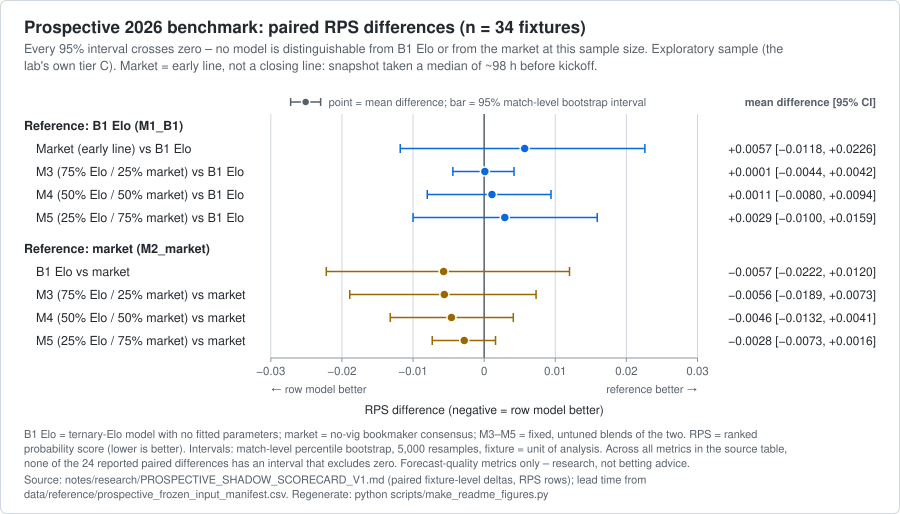
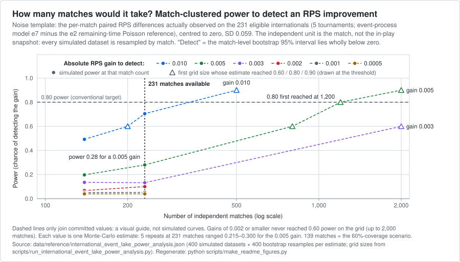
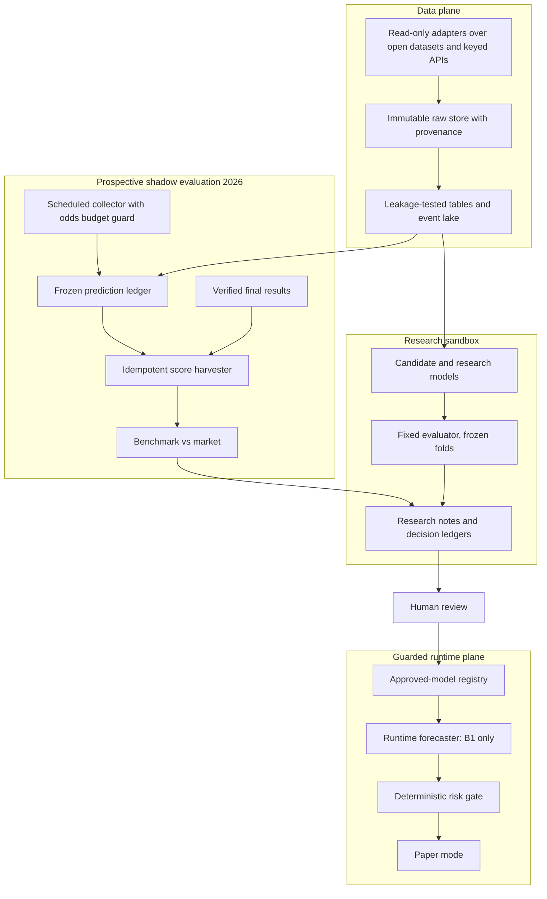

# World Cup Forecasting Lab

**A probabilistic football-forecasting research lab, evaluated prospectively on the 2026 World Cup — built to find out what actually works, and to say so plainly when the answer is "nothing yet".**

[](https://github.com/Mahmoudimahyar/Soccer-forcasting/actions/workflows/tests.yml)


Pre-match win/draw/loss models, in-play models, a tournament simulator, a data-engineering plane, and a
live shadow experiment that froze predictions *before kickoff* during the 2026 World Cup group stage and
scored them afterwards against verified results, with the bookmaker consensus scored alongside as a
read-only comparator.

The headline finding is a **null result, reported as one**: on 34 prospectively scored fixtures, an
Elo model with no fitted parameters, the bookmaker consensus (an *early* line, captured days before
kickoff) and three fixed blends of the two could not be told apart at this sample size. Most of the other
research lines ended the same way — and the lab's own power analysis suggests why. What this repository
offers is not a winning model. It is an attempt to run forecasting research **so that the answer can be
checked**: a fixed evaluator, first-write-wins prediction ledgers, leakage tests, outcome-independent
scoring rules, machine-readable decision ledgers — and a public record of the errors the project found in
itself, including several found only while preparing this release.

> [!IMPORTANT]
> **Research-only and paper-only.** No bet or order was ever placed, no profitability is claimed or shown,
> and nothing here is betting or financial advice. Every reported number is a forecast-quality metric
> (RPS, log-loss, Brier, calibration) — never P&L.

| | |
|---|---|
| **Status** | Research window 2026-06-20 → 2026-06-29; consolidated and published 2026-09-20. **Group stage only** — knockout rounds were never collected or scored. |
| **Approved model** | One: **B1**, a "ternary Elo" — a plain Elo rating gap turned into win/draw/loss probabilities by a fixed formula, with one hand-set draw parameter and nothing fitted. Everything else is research or *shadow*: logged and scored for comparison, never used. |
| **Tests** | **817 passed, 51 skipped, 0 failed** on a fresh clone (Python 3.13). The skips are integration tests that need datasets this repo does not redistribute. |
| **Size** | ~18.5K lines in `src/` (153 modules), ~33.5K in `scripts/`, ~8.4K in `tests/` (82 modules) · 46 schemas · 86 machine-readable ledgers and manifests · ~295 research notes · 26 milestone tags |
| **How it was built** | Human-directed; most of the code, experiments and notes were produced by an AI coding agent (Claude Code) working under a written governance contract. The "audits" in the notes are internal agent audits, not third-party review. [Details](#how-this-was-built) |

---

## The headline result

During the 2026 World Cup group stage a scheduled collector froze pre-kickoff predictions into an
append-only, first-write-wins ledger: 680 rows covering **35 of the 72 group fixtures** — matchdays 2 and 3,
because collection began on 2026-06-21, after matchday 1. After the matches, an independent harvester
scored exactly **one pre-specified snapshot per fixture** against verified final results.

| model | RPS ↓ [95% CI] | log-loss ↓ | draw-Brier ↓ |
|---|---|---|---|
| **B1** — ternary Elo (approved) | 0.1304 [0.0891, 0.1771] | 0.7754 | 0.1833 |
| **M2_market** — no-vig bookmaker consensus | 0.1360 [0.0982, 0.1770] | 0.7740 | 0.1765 |
| M3 — 75% B1 / 25% market | 0.1304 | 0.7712 | 0.1812 |
| M4 — 50% / 50% | 0.1314 | 0.7697 | 0.1793 |
| M5 — 25% B1 / 75% market | 0.1333 | 0.7707 | 0.1778 |

<sub>**RPS** (ranked probability score): squared error between the cumulative forecast and the cumulative outcome over win/draw/loss, so it rewards probability placed near the right result. **Draw-Brier**: Brier score of the draw probability. Lower is better for all three. **No-vig**: bookmaker odds converted to probabilities with the bookmaker margin removed, then averaged across bookmakers.<br>34 fixtures scored, 1 excluded with a recorded reason · 5,000-resample match-level bootstrap · blend weights were fixed in advance, never tuned.</sub>



**Zero of the 24 reported paired differences has a 95% interval that excludes zero.** Elo is nominally
ahead on RPS; the market is nominally ahead on log-loss and draw-Brier. In the repository's own words:
*"no evidence that B1 or any blend beats the market (or vice-versa)."* Nothing was promoted.

Three caveats a careful reader should hold onto:

1. **The "market" here is an early line, not a closing line.** For 31 of the 34 fixtures the scored
   snapshot is an early "baseline" one; across all 34 the median lead time was ~98 hours before kickoff. A bug
   ([ERRATA E2](docs/ERRATA.md)) meant the freezer silently ignored all 47 later odds snapshots the collector
   captured — 25 of them in the T-90 and T-15 windows just before kickoff. The null stands; the comparison is
   weaker than "model versus closing market" and is labelled that way everywhere.
2. **The sample is exploratory.** 34 fixtures sits in the lab's own tier C (20–49); its bar for a
   confirmatory claim is 50+.
3. **The scoring rule was pre-specified, and that is self-attested.** The one-snapshot-per-fixture rule
   depends only on timestamps and coverage, never on outcomes, and was written down before any
   model-versus-outcome metric was computed — but the rule, the script and the results share one commit,
   so the ordering cannot be proven from git.

Read more: [scorecard](notes/research/PROSPECTIVE_SHADOW_SCORECARD_V1.md) ·
[market benchmark](notes/research/PROSPECTIVE_MARKET_BENCHMARK_V1.md) ·
[pre-specification](notes/research/prospective_score_harvest_preregistration.md) ·
[decision ledger](data/reference/prospective_model_decision_ledger.json)

---

## What was learned

Null and negative results are listed as prominently as the positives, because they are most of the results.
ΔRPS is candidate minus reference, so negative means the candidate scored better; brackets are 95%
match-level bootstrap intervals.

| Research line | Question | Result | n | Verdict |
|---|---|---|---|---|
| **Prospective 2026** | Do frozen Elo / blends differ from the bookmaker consensus, out of sample? | No model distinguishable from another at this sample size (market = early line, ~98 h before kickoff) | 34 fixtures | **null** (exploratory) |
| **Pre-match baselines** | Does anything beat plain Elo on freely available data? | No. Best ensemble vs Elo: ΔRPS +0.0011 [−0.0059, +0.0077] | 144 dev matches | **null** → Elo approved |
| 2022 retrospective market study | Does the market add information to Elo? | 75/25 Elo/market blend better on RPS [−0.013, −0.0005]; market alone not significant | 48 matches | **suggestive**: one tournament, several comparisons with no multiplicity correction, nothing promoted |
| Autoresearch loop | Can a bounded agent loop improve the candidate model? | 20 experiments, every variant under the pre-set 0.002 threshold | dev folds | **null** |
| Squad value, FIFA ranking, weighted Elo | Do they add to Elo? | Squad features made CV log-loss worse (0.834 vs 0.813; point estimate, no interval) | 128 matches | **no evidence of improvement** |
| **In-play vs static** | Does updating on score and time beat a pre-match forecast? | Yes: RPS 0.1478 vs 0.1897; ΔRPS −0.0447 [−0.084, −0.005] | 30 matches (2026) | **positive** — labelled "exploratory, not pristine" by the lab; magnitude indicative only |
| In-play Poisson vs time+score baseline | Does an unfitted remaining-time Poisson beat a fitted baseline? | ΔRPS −0.0145 [−0.021, −0.008] on 151 matches; **not confirmed** on a larger overlapping set, where the nested-selected model (plain Poisson chosen in 4 of 6 folds) vs the baseline gave −0.0042 [−0.0083, +0.0002] (plain Poisson vs baseline there: RPS 0.1474 vs 0.1528, no interval reported) | 151 → 302 | **modest positive, unconfirmed** |
| xG features (in-play) | Do six pre-specified xG families help? | None significant (ΔRPS +0.0002 [−0.001, +0.002]) | 302 matches | **null** |
| Player, lineup and dynamic state | Do they beat the Poisson reference? | 0 candidates promoted | 627 matches | **null** |
| Event-process and residual goal intensity | Do rich event features beat the reference? | Nothing cleared the locked multi-rule gate | 58 → 231 matches | **reference_only** |
| Hierarchical club → international transfer | Does club data transfer? | Run had 0 club training rows; lift **untested** | — | **incomplete** |
| Commentary NLP (club football) | Can commentary produce high-precision event labels? | 0 of 12 classes passed the precision gate; closest, corners, 0.786 (Wilson LB 0.768) | 254 games | **negative** |

Each line has a completion report, and most have a machine-readable decision ledger:
**[research index →](notes/research/README.md)** · **[ledgers →](data/reference/README.md)**

### Why the nulls are nulls

The independent unit in this problem is the **match**, not the snapshot: on the 58-match in-play cohort,
inflating snapshots 1×, 2×, 4× and 8× on the same matches left statistical power flat. In the later
231-match rerun — one in-play comparison, using the match-to-match noise actually observed between two
event-process models — the power to detect a 0.005 improvement in RPS was about 0.28, and 80% power was
first reached at the 1,200-match grid point. Those figures depend on the noise template (an earlier, tighter
template suggested ~150 matches and is superseded — [E7](docs/ERRATA.md)), and no power analysis was run for
the pre-match or prospective rows. With that caveat, the honest reading of most rows above is *"no evidence
of improvement at this sample size"* — not *"no effect"*.



---

## Why you might trust this

**Mechanisms**

- **A fixed evaluator.** Time-ordered folds (the 2018 and 2022 group stages plus a 2026 matchday-1 fold
  labelled locked; each trained only on earlier data), a composite objective, a forbidden-column leakage
  guard — and promotion hard-coded to `False`, so research code cannot approve itself. The evaluator and
  its config were never edited after the first commit. ([`program.md`](program.md),
  [`runner.py`](src/wcdrawlab/research/runner.py)) The stricter discipline used for the baseline suite —
  select on 2010/2014/2018 only, read 2022 once — was added in Tier 2, *after* an early sweep had touched
  the 2022 fold (error 2 below). It is a protocol, not something the code enforces.
- **One approved model, enforced in code.** A registry pins B1 as the only runtime model; the forecaster
  raises rather than fall back to a shadow model. ([`approved_models.yaml`](configs/approved_models.yaml))
- **First-write-wins ledgers.** The ledger writer refuses to overwrite an existing key, and integrity
  checks reject post-kickoff or duplicate rows; score rows are keyed on
  `prediction_id + result_hash + scorer_version`, so re-runs add nothing and a corrected result is
  *appended*, never overwritten. (These are local append-only files guarded by code and tests — not a
  signed or externally timestamped log.)
- **Leakage and integrity tests.** Around 118 of the tests are named for leakage, causality, pre-kickoff
  timing, immutability, idempotence, determinism or fail-closed behaviour —
  e.g. [`test_research_leakage.py`](tests/test_research_leakage.py),
  [`test_shadow_integrity.py`](tests/test_shadow_integrity.py),
  [`test_runtime_governance.py`](tests/test_runtime_governance.py),
  [`test_final_holdout.py`](tests/test_final_holdout.py).
- **Decision ledgers, not just prose.** The prospective and later in-play lines end in machine-readable
  verdicts (`reference_only`, `rejected`, `data_insufficient`, …). Not perfectly: one ledger is missing and
  one line reports two vocabularies ([E5, E6](docs/ERRATA.md)); the early pre-match lines are recorded in
  notes and the model registry instead.

**Errors the project caught in itself**

1. **Selection on the test set.** The "best" in-play model had been crowned after repeatedly looking at
   2026 results. The affected claims were downgraded in a machine-readable status registry (the "best
   model" claim to `invalid_due_to_model_selection_on_test_set`, two related claims to exploratory); a nested
   cross-validation rerun on 302 matches never selected it; the frozen model was re-frozen to the plain
   reference, with the first freeze kept as an immutable record.
   ([reconciliation](notes/research/inplay_evaluation_reconciliation.md) ·
   [nested evaluation](notes/research/inplay_nested_evaluation.md))
2. **Release-gate contamination.** A blend weight had been chosen with a sweep that touched the 2022 gate;
   selection was redone on development folds only.
3. **Two data-leakage bugs** in the first modelling table; the score computed on the corrupted table was
   declared invalid rather than kept.
4. **An own-goal inversion bug** found by replaying the 2022 World Cup: Canada 1–2 Morocco had been derived
   as 0–3. Fixed with a provider-aware event-semantics layer that fails closed (48/48 matches now reconcile).
5. **Over-reported coverage**, twice: a backfill that claimed 2,000/2,000 while 1,940 were raw-backed, and
   a cache that claimed 258 files with about 60 on disk. The lab's own evidence registry marks the latter
   `contradicted`; one sprint's git tag is literally `…-incomplete`.
6. **A scorer that silently scored nothing** (exit code 0, empty output) — root-caused with a 14-candidate
   failure matrix and replaced by an independent, idempotent harvester.
7. **More defects found while preparing this release** — and missed for three months before that. Two
   change how recorded results must be read: a dtype bug that invalidated a recorded model comparison
   (E1) and a payload-key mismatch that made the benchmark's market an early line (E2). Others: a CLI
   command that crashed after writing its output, a safety guard that only worked on the author's
   machine, and a crash under pandas 3 that the first CI run exposed. All fixed — see
   **[docs/ERRATA.md](docs/ERRATA.md)** and the [changelog](CHANGELOG.md).

---

## Architecture



| Package | What it does |
|---|---|
| [`wcdrawlab`](src/wcdrawlab) (core) | Ingestion and team-name normalisation, time-safe joins, walk-forward Elo, evaluation metrics, uncertainty reporting, no-vig market conversion, CLI |
| [`models`](src/wcdrawlab/models) · [`simulation`](src/wcdrawlab/simulation) | Ternary Elo (B1), Poisson / Dixon-Coles, and a group-stage simulator implementing the FIFA 2026 tiebreak order |
| [`research`](src/wcdrawlab/research) | The fixed evaluator and the single agent-editable candidate; in-play models; event-process, residual-intensity, transfer and commentary research planes |
| [`operations`](src/wcdrawlab/operations) · [`providers`](src/wcdrawlab/providers) · [`ingestion`](src/wcdrawlab/ingestion) | Read-only, quota-aware adapters; content-addressed raw store; immutable ledger; persistent odds-budget guard |
| [`runtime`](src/wcdrawlab/runtime) | Approved-model registry and a forecaster that fails closed on unknown or shadow models |
| [`inplay`](src/wcdrawlab/inplay) · [`scraping`](src/wcdrawlab/scraping) | The original in-play Poisson engine; a robots-aware source-governance policy for any fetch |
| [`trading`](src/wcdrawlab/trading) | A dormant, paper-mode execution scaffold — see below |

**About the trading package.** It is a triple-gated paper/demo scaffold that was **never armed and never
given credentials**; no order was ever placed. The production order path raises unless three conjunctive
checks all pass (a call argument, an environment flag and an exact acknowledgement string), and the collector refuses to run at all unless `KALSHI_ENABLE_LIVE_TRADING=false` and
`TRADING_MODE=paper`. It is left in the repository, labelled, rather than quietly removed.

---

## Quickstart

```bash
git clone https://github.com/Mahmoudimahyar/Soccer-forcasting.git && cd Soccer-forcasting
python -m venv .venv && source .venv/bin/activate      # Windows: .venv\Scripts\activate
pip install -r requirements.txt && pip install -e .
pytest -q                                              # 817 passed, 51 skipped
python examples/run_demo.py                            # synthetic end-to-end demo, no keys or data needed
```

<sub>The demo exercises the original v0.1 toolkit on **synthetic** odds, so its output includes that era's
betting vocabulary ("edge", Kelly columns). It is an illustration of the plumbing, not a result.</sub>

- **[QUICKSTART.md](QUICKSTART.md)** — API keys, data bootstrap, and how the prospective collector and
  score harvester were run (and can be replayed).
- **[docs/TOOLKIT_USAGE.md](docs/TOOLKIT_USAGE.md)** — the forecasting toolkit and CLI: backtests, truth
  tables, the simulator, uncertainty columns.
- **[docs/README.md](docs/README.md)** — index of all documentation. **[docs/GLOSSARY.md](docs/GLOSSARY.md)** — every model name and metric.

**What you can and cannot reproduce.** The code, tests, schemas, manifests and decision ledgers are all
here. The datasets are not: raw provider payloads and derived tables are deliberately untracked for
licensing reasons, so reproducing a result end to end needs your own API keys and downloads
([data sources](docs/DATA_SOURCES.md)).

## Repository map

| Path | What is there |
|---|---|
| [`src/wcdrawlab/`](src/wcdrawlab) | The library: models, evaluator, in-play, operations, runtime governance |
| [`scripts/`](scripts/README.md) | Entry points, dataset builders, audits, research job queues, schedulers — [index](scripts/README.md) |
| [`tests/`](tests) | 82 modules: leakage, immutability, governance and pipeline tests |
| [`configs/`](configs) · [`schemas/`](schemas) | Model registry, research config, frozen-model manifests; 46 data contracts |
| [`data/reference/`](data/reference/README.md) | 86 machine-readable ledgers, manifests and audits, no raw data — [guide](data/reference/README.md) |
| [`notes/research/`](notes/research/README.md) | The complete research record, including superseded claims — [index](notes/research/README.md) |
| [`docs/`](docs/README.md) | Protocols, runbooks, policies, glossary, errata — [index](docs/README.md) |
| [`data_requests/`](data_requests) | Governed, written requests for any new data source |

## A short glossary

| Name | Meaning |
|---|---|
| **B1** (also `M1_B1`) | Ternary-Elo model, draw parameter r = 0.4, nothing fitted. The only approved model. |
| **M2_market** | No-vig bookmaker consensus. A read-only comparator — never a feature, target or signal. |
| **M3 / M4 / M5** | Fixed 75/25, 50/50 and 25/75 blends of B1 and the market. |
| **In-play M2** | A *different* model: remaining-time Poisson with hand-set constants (`m2_frozen` is its frozen copy). Later lines use closely related Poisson references under other names — W2, R0/R2, T0, e2 — that drop the Elo term. |
| **V8** | The autoresearch candidate (logit blended with Elo). Shadow-only. |
| **No-vig** | Bookmaker odds converted to probabilities with the bookmaker margin removed, so they sum to 1. |
| **Shadow** | Predictions are produced and logged for comparison only; they never drive a displayed forecast or a decision. |
| **RPS** | Ranked probability score for ordered win/draw/loss forecasts. Lower is better. |
| **Tier A–D** | The lab's own sample-size labels: C = 20–49 fixtures ("exploratory"), D = 50+ ("confirmatory"). |
| **LOCO** | Leave-one-competition-out cross-validation. |

Full version: [docs/GLOSSARY.md](docs/GLOSSARY.md).

## How this was built

This project was **directed by a human and executed largely by an AI coding agent** (Claude Code) working
under a written contract: a fixed evaluator it could not edit, a single file it was allowed to change in
the autonomous loop, protected trading/provider/credential paths, and a rule that any new data source must
be requested in writing first. (Those protections governed the autonomous loop; outside it, two later
commits added code under protected paths — `bafd234` binds the paper risk gate to the approved-model
registry and `6bd3e73` adds a provider interface and quota scheduler. Both are additive, and the
[workflow notes](docs/ai-workflow/README.md) show how to check this from git.) The owner set the research questions, the safety constraints and the
promotion rules, and made every decision about paid data and approvals; the agent wrote most of the code,
ran the experiments and wrote the notes. That is why the history is about 170 commits, almost all within
ten days, with unusually long commit messages, and why the notes include the agent's own operating state.

The "audits" and "independent reviews" referred to in the notes are **internal, adversarial agent audits —
not third-party review.** They did catch real errors (above), which is the point of running them. Details:
[docs/ai-workflow/](docs/ai-workflow/README.md).

## Limitations

- **Small samples everywhere**: 48 matches per World Cup fold, 34 prospective fixtures, roughly 9–13 draws
  per evaluation set. Differences between serious models sit inside the noise.
- **Group stage only.** No knockout-round forecasts, extra time or shoot-outs were evaluated.
- **The prospective market comparator is an early line** ([E2](docs/ERRATA.md)).
- **B1's approval means "nothing beat it with significance on free data"** — not that it is strong in
  absolute terms. On the single-read 2022 gate it ranked 5th of 9 by composite score.
- **No in-play model was ever scored prospectively**; the in-play freeze is governance machinery.
- **Several research-line pipelines are single-machine orchestration records** with hard-coded local
  paths. The tests, the toolkit and the prospective harvester are portable.

## What would change the answer

- **More matches, not more snapshots.** The power analysis puts 80% power for a 0.005 RPS gain near 1,200
  matches, against 231 in the event lake and 34 prospective fixtures. The next step is a larger pooled
  match set, not more snapshots per match.
- **A near-kickoff market comparator.** With [E2](docs/ERRATA.md) fixed, the collector's T-90 and T-15
  snapshots now reach the freezer, so a future prospective run can be scored against a late line rather
  than an early one.
- **Knockout rounds**, which were never collected or scored, and a prospective score for the frozen
  in-play model, which is still pending.
- **Club → international transfer**, still untested because the run had no club training rows.

Questions and corrections: [open an issue](https://github.com/Mahmoudimahyar/Soccer-forcasting/issues).

## Data sources and attribution

Open data from StatsBomb, SoccerNet, martj42 and the Fjelstul World Cup Database, plus keyed APIs
(football-data.org, API-Football, The Odds API) and the keyless Open-Meteo. **No raw third-party data is redistributed
here** — only identifiers, hashes, aggregate counts and the lab's own ledgers. Event data comes from
[StatsBomb Open Data](https://github.com/statsbomb/open-data) (non-commercial research use, credited per
their user agreement); commentary from SoccerNet-Echoes (CC BY 4.0). Licences, terms and the
required attribution lines are in **[docs/DATA_SOURCES.md](docs/DATA_SOURCES.md)**. The MIT licence covers
the code only.

## Licence and citation

[MIT](LICENSE) © 2026 [@Mahmoudimahyar](https://github.com/Mahmoudimahyar). If this is useful in your own
work, see [CITATION.cff](CITATION.cff). Corrections are welcome — see [CONTRIBUTING.md](CONTRIBUTING.md)
and [docs/ERRATA.md](docs/ERRATA.md).
